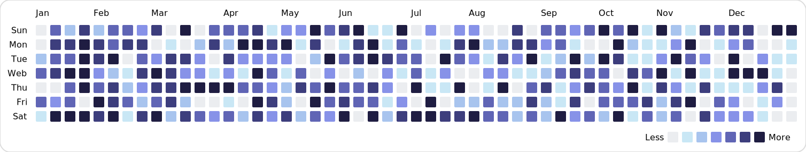

# svg-heatmap
Generate GitHub-style SVG heatmaps

## Install
```
yarn add svg-heatmap
```

## Usage
```javascript
import { generate, PalettePresets } from "svg-heatmap";

// Push some random data
const data = [];
for (let i = 0; i < 365; i++) {
  data.push(Math.floor(Math.random() * 5));
}

const svg = generate(data, 2019, PalettePresets.gitHub);
```
### GitHub Palette


### Blue Palette


### Auto Generated Palette

